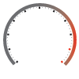

# ST7789 Panel Elements

For this project I wanted to create a range of useful panel elements that could be displayed on 
the cheap and common ST7789 TFT/LCD/OLED displays that one finds on eBay etc.

I generally drive them from ESP and ESP-S2 processors, the example above is from the TTGO.

In particular I wanted a flexible set of gauges, meters, counters and LED representations that I could use on any screen size.

## Thanks go out to:

- https://github.com/russhughes/st7789_mpy for the driver this is based on.

-- Andy

## General

The project expects files to be organised:

    /lib - python class files
    /bitmap - bitmap.py files used for bezels etc.

Files in these directories are the only ones needed to be uploaded to a processor running the Russ Hughes firmware, or having the ST7789 driver installed.

## BMP naming and creation

At the moment the following convention is used for gauges:

    'g' + box-size + 'optional colour hint'

For a 100x100 gauge this would be 'g100.BMP'.  If you supply your own background you might use 'g100myvariant.BMP'.

### Creating BMP and associated bitmap files

I've found the best way to create the required small clean bitmap .py files is to start with an SVG/AI file and then export it as a BMP.  The following syntax has worked for me:

    python3 ../../st7789_mpy/utils/imgtobitmap.py g100plain.BMP 2 > ../bitmap/g100plain.py

## gauge_class

This will create a gauge with a 270 degree sweep, a legend for units and display the value in the lower centre section.

It's initilised thus:

    import lib.gauge_class as gauge_class
    g1 = gauge_class.gauge(tft,4,0,100,bezel='bitmap.g100orange',units='Flux')

and updated:

    g1.update(value)

- display - a reference to the ST7789 display, 
- xpos - the top left X position, 
- ypos - the top left Y position, 
- box - the size of the bounding box, typically 100 or 240 at the moment - see the jpg directory for supplied background sizes, 
- bezel - the name of the bitmap.py file in the bitmap directory in the form 'bitmap.<your file> but without the .py, 
- units="Units" - the units legent, 
- low=0 - the lowest value expected for the gauge, 
- high=100, - the highest value expected for the gauge,
- bg=st7789.WHITE - gauge background colour, 
- fg=st7789.BLACK - colour for gauge foregound elements

At the moment, fonts are selected based on the box size, see the code for logic.

## Meter

    import lib.meter as meter

    init: m1 = meter.Meter(tft,110,4,100,30,legend='kWhr')
    update: m1.update(value)

- display - a reference to the ST7789 display, 
- xpos - the top left X position, 
- ypos - the top left Y position, 
- xbox - width of meter 100 implemented currently
- ybox - depth of meter 30 implemented currently
- legend - legend for lower bar
- bezel - specify an alternate bezel e.g '../jpg/MeterBezelAlt2.jpg'  The dimensions should match xbox/ybox
- max=1000 - maximum value to be displayed before #### shown
- bg=st7789.WHITE - meter background colour, 
- lc=st7789.BLACK - colour for meter value display
- fg=st7789.BLACK - colour for meter legend elements

Currently fonts are fixed - see code

## Screen LED

This will create an 'LED' on the display.

Init:

    import lib.ScreenLED as ScreenLED
    l1 = ScreenLED.LED(tft,200,90,30, legend='Test')

Update:

    l1.update(<state>)

- display - a reference to the ST7789 display, 
- xpos - the top left X position, 
- ypos - the top left Y position, 
- diameter - diameter of LED in pixels
- legend - legend for lower bar
- bg=st7789.WHITE - LED background colour, 
- lc=st7789.RED - colour for True state of the LED
- fg=st7789.BLACK - colour for LED legend and bezel elements
