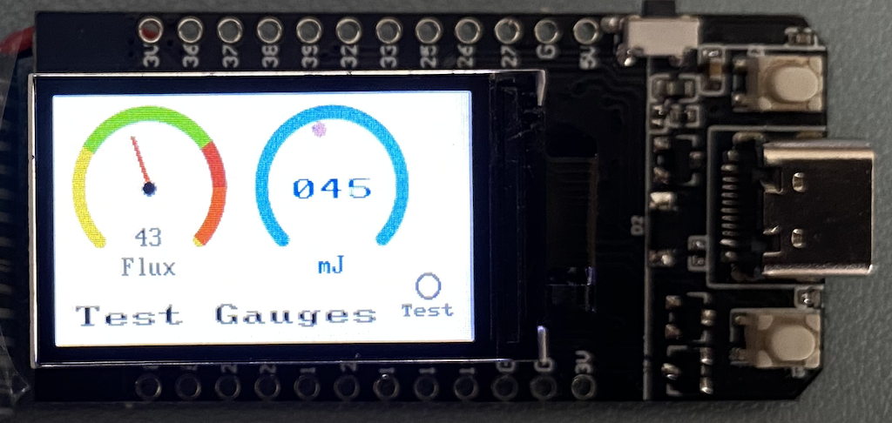

# ST7789 Panel Elements

For this project I wanted to create a range of useful panel elements that could be displayed on 
the cheap and common ST7789 TFT/LCD/OLED displays that one finds on eBay etc.

I generally drive them from ESP and ESP-S2 processors.

In particular I wanted a flexible set of gauges, meters, counters and LED representations that I could use on any screen size.

## Thanks go out to:

- https://github.com/russhughes/st7789_mpy for the driver this is based on.

-- Andy

## General

The project expects files to be organised:

    /lib - python class files
    /jpg - jpgs used in backgrounds

## JPG naming and creation

At the moment the following convention is used for gauges:

>   'g' + box-size + 'optional colour hint'

For a 100x100 gauge this would be 'g100.jpg'.  If you supply your own background you might use 'g100myvariant.jpg'.

### Creating JPGs

I've found the best way to create the required small clean JPGs is to start with an SVG file and then use ImageMagick to convert it into a JPG.  The following syntax has worked for me:

convert g240plain-01.svg -type TrueColor g240plain.jpg

## gauge_class

This will create a gauge with a 270 degree sweep, a legend for units and display the value in the lower centre section.

It's initilised thus:

    > g1 = gauge_class.gauge(tft,4,0,100,'orange',units='Flux')

and updated:

    > g1.update(value)

- display - a reference to the ST7789 display, 
- xpos - the top left X position, 
- ypos - the top left Y position, 
- box - the size of the bounding box, typically 100 or 240 at the moment - see the jpg directory for supplied background sizes, 
- color_hint - an addition parameter to select a particular background 'orange' with a box size of 100 would select 'g100orange.jpg', 
- units="Units" - the units legent, 
- low=0 - the lowest value expected for the gauge, 
- high=100, - the highest value expected for the gauge,
- bg=st7789.WHITE - gauge background colour, 
- fg=st7789.BLACK - colour for gauge foregound elements

At the moment, fonts are selected based on the box size, see the code for logic.

